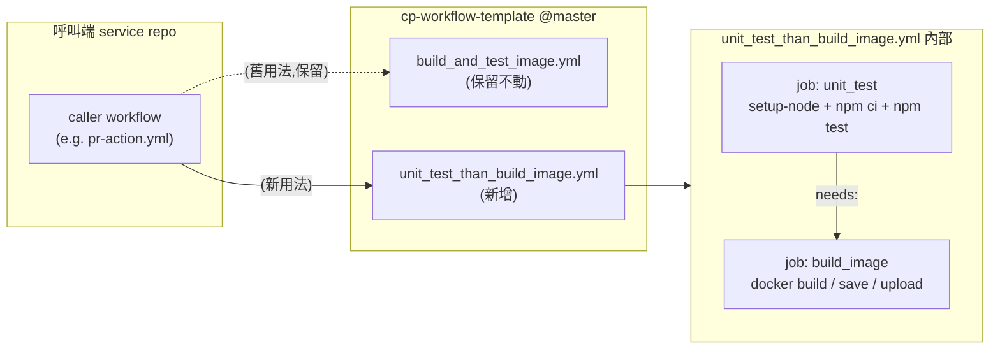

# Plan: Unit-test-then-build reusable workflow

> 🟢 In progress — implementation underway

## 1. Goal

新增一個 reusable workflow `.github/workflows/unit_test_than_build_image.yml`，內部先用 GitHub Actions runner 直接跑 `npm test`，通過後才執行 docker image 的 build / save / upload；現有 `build_and_test_image.yml` 保留不動。成功標準：呼叫端可改用 `uses: .../unit_test_than_build_image.yml@master`，並觀察到 `unit_test` job 先跑、失敗會直接擋住 build job。

## 2. Context

現有 `build_and_test_image.yml` 把 `npm test` 放在「build image 完成後再進到 container 內執行」（見 [build_and_test_image.yml:50-56](/.github/workflows/build_and_test_image.yml#L50-L56)）。這代表：
- 任何 test 失敗都要先付出一次完整 image build 的時間成本。
- test log 包在 docker run 裡，較難在 Actions UI 上直接展開閱讀。

新工作流把 `npm test` 直接挪到 runner 上、放在 build 之前，可以提早 fail-fast、log 也更直觀。為了不影響其他已經串好的呼叫端，現有檔案保持原樣，新行為以「新檔案」形式並存。

## 3. Scope

### In scope

- [x] 新增 `.github/workflows/unit_test_than_build_image.yml`，為 `workflow_call` reusable workflow
- [x] 新檔案內含兩個 job：`unit_test`（runner 直接跑 `npm test`）、`build_image`（沿用現有 build/save/upload 步驟），用 `needs: unit_test` 串接
- [x] 暴露 `node-version` input（`type: string`、`required: false`、`default: '22.16.0'`），caller 可覆寫
- [x] `unit_test` job 用 `actions/setup-node` 安裝 Node、執行 `npm ci`（帶 `DEVOPS_READ_PACKAGE_TOKEN`）然後 `npm test`
- [x] 在 README 的 folder structure 列表補上新檔名

### Out of scope (explicit)

- [ ] **不修改** `build_and_test_image.yml`（保留現有行為，避免 breaking 已串好的呼叫端如 [push-action.yml:9](/.github/workflows/push-action.yml#L9)）
- [ ] **不處理** `CI_ONEINCH_API_KEY`（依使用者指示先不放進新 workflow）
- [ ] **不修改** 既有 caller workflow（`pr-action.yml` / `push-action.yml`）讓它們改用新檔案 — 切換是各 service repo 自己決定的事
- [ ] **不調整** image build 邏輯本身（`docker build` 指令、tag 策略、artifact 上傳條件全部照舊）

### Deferred

- [ ] 將 `pr-action.yml` 內 docker-based 的 unit test 改成 runner 直跑（同樣的優化思路，但目標檔案不同，留待後續）

## 4. Approach

新檔 `unit_test_than_build_image.yml` 結構：

```yaml
name: Unit test then build image

on:
  workflow_call:
    inputs:
      node-version:
        type: string
        required: false
        default: '22.16.0'
    secrets:
      PROD_CP_GCP_PROJECT_ID: { required: true }
      DEV_CP_GCP_PROJECT_ID:  { required: true }
      DEVOPS_READ_PACKAGE_TOKEN: { required: true }   # ⚠ 與 build_and_test_image 不同：required
env:
  REGISTRY: gcr.io

jobs:
  unit_test:
    runs-on: ubuntu-latest
    steps:
      - uses: actions/checkout@main
      - uses: actions/setup-node@v4
        with:
          node-version: ${{ inputs.node-version }}
          cache: 'npm'
      - name: Install deps
        env:
          NPM_TOKEN: ${{ secrets.DEVOPS_READ_PACKAGE_TOKEN }}
        run: npm ci
      - name: Unit test
        run: npm test

  build_image:
    needs: unit_test
    runs-on: ubuntu-latest
    steps:
      # 完全照搬 build_and_test_image.yml 的 Export environments / Build image / Save image / Upload artifact
      # 唯獨「Unit test」step 不複製過來
```

設計重點：
- **`node-version` 走 `workflow_call.inputs`**，預設 `22.16.0`、`required: false`。caller 不傳就用預設值；要用其他版本就 `with: { node-version: '...' }` 覆寫。
- **`DEVOPS_READ_PACKAGE_TOKEN` 在新檔改為 `required: true`**（原檔是 `false`），因為現在 `npm ci` 直接在 runner 上跑，沒有 token 就裝不到 private package。這是 caller 必須察覺的差異。
- **`unit_test` job 不做 docker 任何操作**，純 Node 環境，符合「直接在 action 上面驗證」的需求。
- **`build_image` job 完整繼承**現有 `build_and_test_image.yml` 的 4 個 step（Export environments / Build image / Save image / Upload artifact），只刪掉 Unit test step。

## 5. Alternatives considered

### Alternative A：把 `build_and_test_image.yml` 直接改掉（單檔 in-place 修改）
- **What**：直接把現有檔案的 Unit test step 拿掉、在最前面加 unit_test job。
- **Why not**：使用者明確要求「build_and_test_image.yml 要保留」，且這檔案已被多個 service repo 透過 `@master` 引用，in-place 修改會把 token requirement 從 optional 變成 required，瞬間 break 所有沒設定 token 的 caller。

### Alternative B：用更上層的 caller workflow 把兩個現有檔案串起來（不建新檔，純靠 `pr-action.yml` 之類用 `needs:`）
- **What**：另寫一個 unit-test-only 的 reusable workflow，再讓每個 service repo 在自己的 caller 裡用 `needs: unit_test` 接 build。
- **Why not**：使用者明確選 (A) 「兩個 job 在同一個 reusable workflow 裡用 needs 串」，呼叫端只要換一個 `uses:` 路徑即可，不用改 caller 結構。

### Alternative C：兩個 job 都 `runs-on: ubuntu-latest` 但共享 workspace（用 `actions/cache` 傳 node_modules 給 build job）
- **What**：在 unit_test job cache `node_modules`，build job restore 後直接 docker build。
- **Why not**：build job 是 docker build，會在 image 內部重新 `npm install`（透過 `NPM_TOKEN` build-arg），跟 host 的 `node_modules` 沒關係，cache 過去也用不到，徒增複雜度。

## 6. Diagrams

### Caller → reusable workflow 的關係



### Job 內部步驟對照（新 vs 舊）

```mermaid
sequenceDiagram
    participant Caller
    participant UT as unit_test (runner)
    participant BI as build_image (runner)
    participant Reg as docker / artifact

    Caller->>UT: trigger workflow_call
    UT->>UT: checkout
    UT->>UT: setup-node + npm ci (DEVOPS_READ_PACKAGE_TOKEN)
    UT->>UT: npm test
    alt npm test fails
        UT-->>Caller: ❌ fail-fast (build_image 不會跑)
    else npm test passes
        UT->>BI: needs satisfied
        BI->>BI: Export environments
        BI->>Reg: docker build -t $IMAGE
        BI->>Reg: docker save image.tar (only on dev/master)
        BI->>Caller: ✅ artifact uploaded
    end
```



## 7. PR Breakdown

### PR 1: feat(workflows): add unit_test_than_build_image reusable workflow — ~80 lines
- **Category**: Feature
- **Branch**: `feat/CW-27778-unit-test-then-build` (already on `CW-27778`)
- **Goal**: 新增 `unit_test_than_build_image.yml` 並在 README 補上檔名，使呼叫端可選擇先在 runner 跑 `npm test` 再 build image。
- **Depends on**: none
- **Merge order**: 1st (only PR)
- **Commits**:
  - [x] `feat(workflows): add unit_test_than_build_image reusable workflow`
  - [x] `docs(readme): list unit_test_than_build_image in folder structure`

僅一個 PR，diff < 100 行，無需拆分。

## 8. Testing strategy

因為這個 repo 只是 template 集合，本地無法直接 `act` 或 `gh workflow run` 驗證（沒有 `package.json` / `Dockerfile`）。實際驗證要在「呼叫端 service repo」做：

- **YAML 靜態檢查**：用 `yamllint` 或 `actionlint` 對新檔做 lint（手動或加進 CI 都可）。
- **語法可解析驗證**：開 PR 後 GitHub 會解析 workflow，若 syntax 錯會直接報錯。
- **End-to-end 驗證（實機）**：挑一個現成的 service repo（例如已使用 `build_and_test_image.yml` 的 repo），新開一個測試 branch，把 caller workflow 的 `uses:` 路徑改成 `unit_test_than_build_image.yml@<feature-branch>`，跑一次 PR：
  - 驗證 `unit_test` job 先跑、log 看得到 `npm test` 輸出。
  - 故意讓 test 失敗一次，確認 `build_image` job 不會被觸發。
  - 修回去後跑成功，確認 `build_image` job 行為與舊檔一致（artifact 仍在 dev/master 才上傳）。
- **不測**：不為這個 template repo 本身寫 unit test（template 沒有 runtime code 可測）。

## 9. Risks & open questions

- **Risk**：預設 `node-version: '22.16.0'` 與某些 service repo 預期的版本不一致，導致該 repo `npm ci` 或 `npm test` 出錯。
  - **Mitigation**：caller 可透過 `with: { node-version: '<其他版本>' }` 覆寫；若不想改 caller，也能繼續用舊 `build_and_test_image.yml`（其 Node 版本由各自 Dockerfile 決定）。
- **Risk**：`DEVOPS_READ_PACKAGE_TOKEN` 在新檔變成 required，沒設定的 caller 切過來會 fail。
  - **Mitigation**：在 commit message / PR description 明寫此差異；新檔本身的 secrets block 已標 `required: true` 強制 caller 提供。
- **Assumption**：呼叫端 repo 的 `npm test` 不需要任何只在 docker image 內存在的環境（例如 Dockerfile 安裝的系統套件）。若有，新工作流會 fail。 — 若假設不成立，那個 repo 就應繼續用舊 `build_and_test_image.yml`，不要切過來。
- **Open**：`actions/checkout@main` vs `@v4` — 現檔用 `@main`，新檔沿用同模式即可，但實務上 pin 到固定 tag 較安全；本次保持與既有風格一致。
- ~~**Open**：Node 版本來源~~ → **Resolved (2026-05-04)**：用 `workflow_call.inputs.node-version`（`required: false`、`default: '22.16.0'`），caller 可覆寫。

## 10. Done criteria

- [x] `.github/workflows/unit_test_than_build_image.yml` 存在（GitHub workflow parser 驗證待 push 後確認）
- [x] 新檔 `unit_test` job 不含任何 `docker` 指令
- [x] 新檔 `workflow_call.inputs.node-version` 存在且預設值為 `'22.16.0'`
- [x] 新檔 `build_image` job 的步驟順序與 `build_and_test_image.yml` 的非-test 步驟一致（Export environments / Build image / Save image / Upload artifact）
- [x] `build_and_test_image.yml` 與目前 git HEAD 內容完全相同（`git diff` 為空）
- [x] README 的 folder structure 區塊列出新檔名
- [ ] PR 描述中註明 `DEVOPS_READ_PACKAGE_TOKEN` 由 optional 變 required 的差異
- [ ] 至少在一個 service repo 做過一次 end-to-end 試跑（test 失敗 → build 被擋；test 成功 → build 與舊行為一致）

---

## Appendix: decisions log

- 2026-05-04 — 採用「新增獨立檔案」而非 in-place 修改 `build_and_test_image.yml` — 使用者要求保留舊檔，且舊檔已被多個 caller 引用，in-place 改 secret 為 required 會造成 breaking change。
- 2026-05-04 — `CI_ONEINCH_API_KEY` 暫不納入新檔 — 使用者明確指示「這個先不用」。
- 2026-05-04 — Node 版本由 `workflow_call.inputs.node-version` 帶入、預設 `22.16.0` — 一開始選 (c) hardcode，討論後改為 input + default，使 caller 可選擇性覆寫，仍保留「不傳就用預設」的簡單行為。
