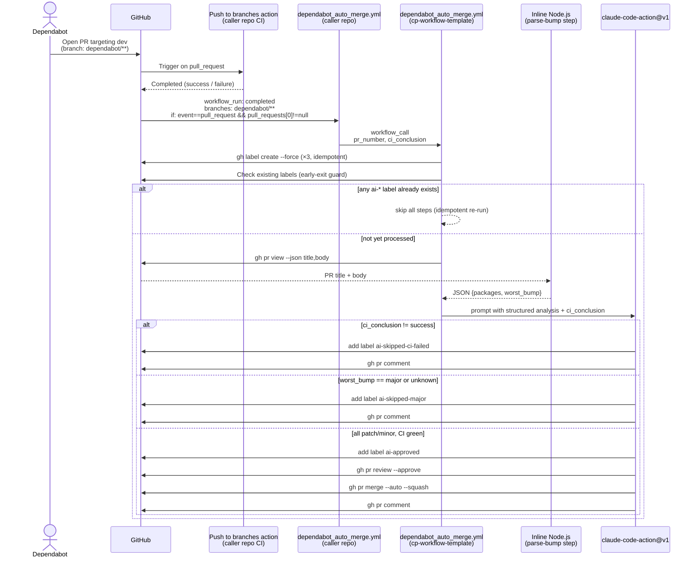
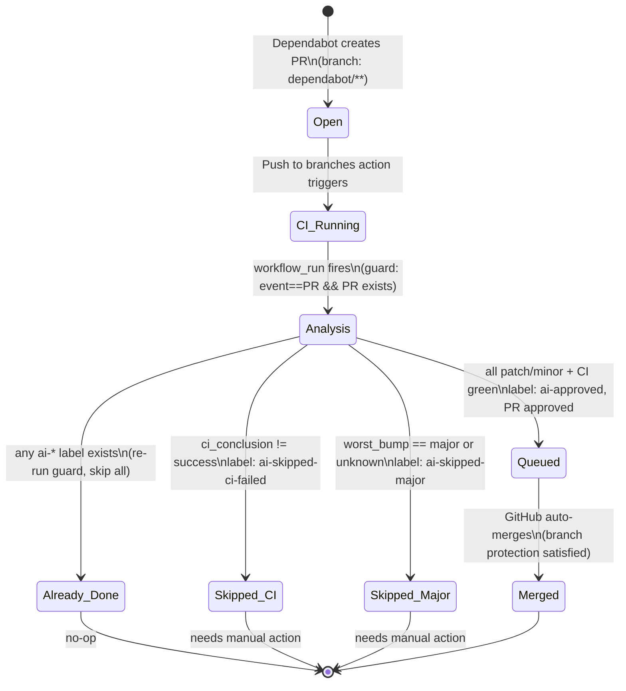

# Plan: Dependabot Auto-merge via Claude

> 🟡 Draft — Awaiting approval to implement

## 1. Goal

Build a reusable GitHub Actions workflow in `cp-workflow-template` that uses a script to parse Dependabot PR bump types and `anthropics/claude-code-action@v1` to make the merge decision and post a human-readable explanation — automatically approving and merging patch/minor bumps when CI is green, and skipping with a comment for major bumps or CI failures.

**Success criterion:** All three caller repos (node-proxy, crypto-swap, node-graphql) trigger the workflow on every Dependabot PR; a label and Claude comment appear on every run; auto-merge fires only for patch/minor + CI green; re-runs on the same PR are idempotent.

## 2. Context

Dependabot PRs accumulate without being reviewed or merged because patch/minor dependency bumps feel low-priority yet still require human attention. The actual decision logic is simple and mechanical — if CI is green and the bump is non-major, merge it — but no one has automated it. Centralizing the workflow in `cp-workflow-template` means the rules live in one place; all caller repos benefit from future updates without touching their own code.

## 3. Scope

### In scope

- [ ] `dependabot_auto_merge.yml` reusable workflow in `cp-workflow-template`
- [ ] Early-exit guard: skip all steps if PR already has any `ai-*` label (prevents duplicate comments, approvals, and merges on re-runs)
- [ ] Inline Node.js script (no npm packages) to parse bump type from PR title/body
- [ ] `claude-code-action@v1` step: receives structured bump analysis, decides GO/NO-GO, takes GitHub actions, posts comment
- [ ] Label auto-creation with `--force` (idempotent, no manual repo setup)
- [ ] Three labels: `ai-approved`, `ai-skipped-major`, `ai-skipped-ci-failed`
- [ ] README section with caller workflow template and org secret checklist

### Out of scope (explicit)

- [ ] Adding caller workflows to node-proxy, crypto-swap, node-graphql (follow-up PRs in those repos)
- [ ] Slack notification on auto-merge (not in ticket)
- [ ] Configurable merge strategy per caller (fixed as `--squash`)
- [ ] Handling non-Dependabot PRs
- [ ] Auto-rebase or auto-close stale Dependabot PRs
- [ ] Claude reading external changelogs or release notes (PR body only)

### Deferred

- [ ] Making merge strategy (`--squash` / `--merge` / `--rebase`) an optional workflow input
- [ ] Org-level label templates — each caller repo auto-creates its own labels on first run (acceptable for now)

## 4. Approach

### Two-step architecture: script parses, Claude decides

**Step 0 — Early-exit if already processed**

Before any expensive operations, check if the PR already has an `ai-*` label. If yes, all subsequent steps are skipped — the workflow has already run and acted on this PR.

```bash
ALREADY=$(gh pr view ${{ inputs.pr_number }} \
  --json labels \
  --jq '[.labels[].name] | any(test("^ai-"))' \
  --repo ${{ github.repository }})
# "true" → skip; "false" → proceed
```

This prevents the following re-run scenario from causing duplicate actions:
```
Dependabot opens PR → CI success → workflow_run → Claude approves
                                                          ↓
                            PR synchronize (Dependabot rebases)
                                                          ↓
                            CI reruns → workflow_run fires again
                                                          ↓
                            Early-exit: ai-approved label exists → skip
```

**Step 1 — Parse bump type (inline Node.js, no npm packages)**

```
gh pr view <pr_number> --json title,body
  → try regex on title: "from X.Y.Z to A.B.C"
  → if no match: scan body for version table (grouped / monorepo updates)
  → classify each package: major / minor / patch
  → determine worst_bump across all packages
  → write JSON to GITHUB_OUTPUT
```

Output structure passed to Claude:
```json
{
  "packages": [
    { "name": "axios", "from": "1.2.3", "to": "1.4.0", "bump": "minor" },
    { "name": "lodash", "from": "4.17.20", "to": "4.17.21", "bump": "patch" }
  ],
  "worst_bump": "minor"
}
```

Version classification uses pure string/number comparison (no semver package needed):
```javascript
function classifyBump(from, to) {
  const [fMaj, fMin] = from.split('.').map(Number);
  const [tMaj, tMin] = to.split('.').map(Number);
  if (tMaj > fMaj) return 'major';
  if (tMin > fMin) return 'minor';
  return 'patch';
}
```

If the body regex produces zero matches, `worst_bump` is set to `"unknown"` → Claude skips merge (fail-safe).

**Step 2 — Claude decision + action**

Claude receives structured data via prompt (no raw PR text parsing). Claude's responsibilities:
- Apply decision rules
- Execute GitHub actions via `gh` CLI
- Write a human-friendly comment

Decision rules:

| Condition | Label | Action |
|---|---|---|
| `ci_conclusion != success` | `ai-skipped-ci-failed` | comment only |
| `worst_bump == major` or `unknown` | `ai-skipped-major` | comment only |
| all patch/minor + CI green | `ai-approved` | approve + merge + comment |

### Trigger: `workflow_run` on the existing CI workflow

Caller repos already run a CI workflow named **"Push to branches action"** (which calls `build_and_test_image.yml@master`) for every PR. The caller uses:

```yaml
on:
  workflow_run:
    workflows: ["Push to branches action"]
    types: [completed]
    branches:
      - 'dependabot/**'
```

Benefits over triggering on `pull_request`:
- Fires only after CI completes — no idle runner waiting
- `github.event.workflow_run.conclusion` gives the CI result directly
- Runs in default branch context → **`ANTHROPIC_API_KEY` and `GH_AUTO_MERGE_TOKEN` are regular org-level secrets** (not Dependabot secrets namespace)

### Caller `if` guard (double check)

```yaml
jobs:
  auto-merge:
    if: |
      github.event.workflow_run.event == 'pull_request' &&
      github.event.workflow_run.pull_requests[0] != null
```

- `event == 'pull_request'`: ensures the CI run was triggered by a PR event, not a direct push to a `dependabot/**` branch (which would leave `pull_requests` empty)
- `pull_requests[0] != null`: ensures PR context is available before passing `pr_number`

### Reusable workflow inputs

| Input | Type | Required | Source in caller |
|---|---|---|---|
| `pr_number` | number | yes | `github.event.workflow_run.pull_requests[0].number` |
| `ci_conclusion` | string | yes | `github.event.workflow_run.conclusion` |

### Secrets

| Secret | Where to set | Notes |
|---|---|---|
| `ANTHROPIC_API_KEY` | Org-level repository secret | NOT Dependabot secrets namespace |
| `GH_AUTO_MERGE_TOKEN` | Org-level repository secret (PAT) | Needs `repo: all` |

### Files to create

```
.github/workflows/dependabot_auto_merge.yml
```

## 5. Alternatives considered

### Alternative A: Claude parses bump type AND decides

- **What**: Give Claude the raw PR title/body and ask it to extract versions, classify bump type, then decide and act — all in one prompt.
- **Why not**: Version number extraction is deterministic; using AI for it adds hallucination risk and wastes tokens on a mechanical task. Claude may misread grouped update formats or invent versions. Script parsing is faster, cheaper, and 100% reliable.

### Alternative B: Full script, no Claude

- **What**: Bash + inline Node.js handles everything: parse bump type, check CI, apply label, approve, merge, post a fixed-template comment.
- **Why not**: The decision logic can be scripted, but the comment would be a static template. Claude adds value writing a context-aware explanation that builds team trust in the automation. Also, `claude-code-action@v1` is explicitly required by the ticket.

### Alternative C: `pull_request` trigger + `gh pr checks --watch`

- **What**: Trigger on `pull_request: [opened, synchronize]`, poll CI with `gh pr checks --watch` before invoking Claude.
- **Why not**: The runner idles for the full CI duration (10–20 min per Dependabot PR). Also requires `ANTHROPIC_API_KEY` in the Dependabot secrets namespace, adding operational overhead. The `workflow_run` trigger solves both problems.

## 6. Diagrams

### Sequence: trigger → parse → decide → act



### State: Dependabot PR lifecycle



## 7. PR Breakdown

### PR 1: Add dependabot_auto_merge reusable workflow — ~140 lines
- **Category**: Feature
- **Branch**: `feat/CW-28259-dependabot-auto-merge`
- **Goal**: Add the reusable workflow (early-exit guard + parse step + Claude step) and document caller template in README
- **Depends on**: none
- **Merge order**: 1st
- **Commits**:
  - [x] `feat(workflows): add dependabot_auto_merge reusable workflow`
  - [x] `docs: add dependabot auto-merge section to README`

---

## 8. Testing strategy

- **Manual verification (primary)**: On one caller repo, create a test branch named `dependabot/test-patch-bump` with a trivial package version change and open a PR. Confirm: workflow triggers after CI, labels are created, Claude comment appears, label matches bump type.
- **Negative cases to verify manually**:
  - Major bump → `ai-skipped-major` label + comment, no merge
  - CI failure → `ai-skipped-ci-failed` label + comment, no merge
  - Grouped update PR → Claude correctly summarizes all packages
  - Parse failure (unusual format) → `worst_bump: unknown` → skip + comment
- **Re-run idempotency**: Trigger the workflow twice on the same PR (e.g., re-run the failed job) → second run exits early without adding duplicate labels or comments
- **Guard condition**: Push directly to a `dependabot/**` branch without a PR → caller `if` guard blocks the job before it starts
- **Unit tests**: None — GitHub Actions have no practical unit test framework; manual test cases cover the behavior
- **Not tested**: Exact Claude comment text (non-deterministic); label colors in GitHub UI

## 9. Risks & open questions

- **Assumption: auto-merge is enabled in each caller repo's settings** — `gh pr merge --auto` queues silently but never executes if auto-merge is disabled at the repo level. Must be enabled once per repo (Settings → General → Allow auto-merge). Added to Done criteria.
- **Assumption: `gh pr merge --auto --squash` respects branch protection** — Auto-merge queues; GitHub executes only when all required checks pass. If a repo requires more than Claude's single approval, the PR stays queued until human reviewers act. This is correct behavior.
- **Risk: grouped update body format changes** — Dependabot's PR body format is not a public API. If Dependabot changes its markdown structure, the body regex may stop matching and fall back to `worst_bump: "unknown"`. Claude treats `unknown` as a skip-merge signal — fail-safe by default.
- **Risk: `anthropics/claude-code-action@v1` breaking changes** — Pinned to `v1`. Mitigation: pin to a specific SHA in a follow-up hardening PR if stability becomes a concern.
- **Risk: PR synchronized after Claude approves, before auto-merge fires** — Dependabot sometimes rebases its own PR. If this happens, a new `workflow_run` fires. The early-exit guard detects the `ai-approved` label and skips — no double approval or comment. Auto-merge remains active on the updated commit.

## 10. Done criteria

- [ ] `dependabot_auto_merge.yml` merged to `master` in `cp-workflow-template`
- [ ] README updated with caller workflow template snippet and org secret checklist
- [ ] Caller workflow added to `node-proxy` (separate PR in that repo)
- [ ] Caller workflow added to `crypto-swap` (separate PR in that repo)
- [ ] Caller workflow added to `node-graphql` (separate PR in that repo)
- [ ] Auto-merge enabled in GitHub repo settings for all three caller repos
- [ ] `ANTHROPIC_API_KEY` confirmed as org-level secret accessible to all three repos
- [ ] `GH_AUTO_MERGE_TOKEN` (PAT) confirmed as org-level secret with `pull-requests: write` and `contents: write` scopes
- [ ] Manual test: patch bump Dependabot PR → `ai-approved` + Claude comment + auto-merged
- [ ] Manual test: major bump → `ai-skipped-major` + Claude comment, no merge
- [ ] Manual test: CI failure → `ai-skipped-ci-failed` + Claude comment, no merge
- [ ] Re-run idempotency verified: second workflow run on same PR exits early, no duplicate actions
- [ ] Caller guard verified: direct push to `dependabot/**` branch does not trigger the job

---

## Appendix: decisions log

- 2026-06-17 — Chose `workflow_run` over `pull_request + --watch`: eliminates idle runner time; `ANTHROPIC_API_KEY` stays a regular org-level secret (no Dependabot secrets namespace needed).
- 2026-06-17 — Chose hybrid architecture (script parses, Claude decides+explains) over all-Claude: version parsing is deterministic — AI adds hallucination risk for zero benefit there. Claude's value is in decision reasoning and human-friendly communication.
- 2026-06-17 — Added early-exit guard (check existing `ai-*` labels) to make re-runs idempotent. Prevents duplicate comments/approvals if Dependabot rebases the PR after Claude has already acted.
- 2026-06-17 — Added double guard to caller `if`: `event == 'pull_request' && pull_requests[0] != null`. Prevents the job from running when `workflow_run` fires on a direct push to a `dependabot/**` branch where no PR context exists.
- 2026-06-17 — Label names use full kebab-case (`ai-skipped-major`, not `ai-skipped: major`) for ease of search, automation, and metrics queries.
- 2026-06-17 — CI workflow name confirmed as `"Push to branches action"` (uniform across all three caller repos).
- 2026-06-17 — Labels auto-created with `--force` inside the reusable workflow — no manual per-repo setup required.
- 2026-06-17 — Claude treats `worst_bump: unknown` (parse failure) as skip-merge signal to avoid accidental merges on unrecognized formats.
- 2026-06-17 — Added two-layer risk assessment: Layer 1 reads full PR body (Dependabot changelog) for security/breaking-change signals; Layer 2 greps the checked-out codebase to find usage of changed APIs. Claude fetches PR body itself via `gh pr view` in the prompt rather than passing it through `GITHUB_OUTPUT` — avoids shell escaping issues with arbitrary body content.
- 2026-06-17 — Secret renamed from `GH_TOKEN` to `GH_AUTO_MERGE_TOKEN` for identifiability in org secret list and audit logs.
